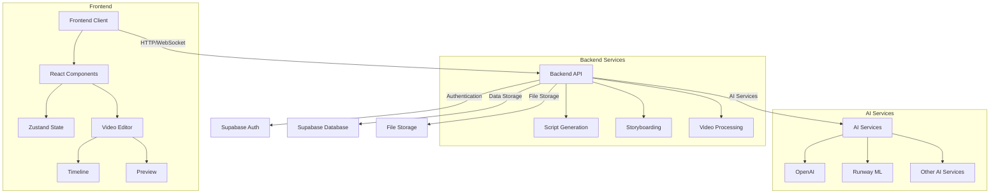
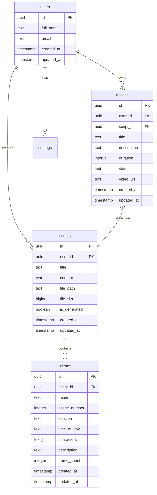

# RoboMovie 🎬

A powerful AI-driven video production platform that streamlines the process from script generation to final video editing.

## Overview

RoboMovie is a comprehensive video production application that combines AI capabilities with professional video editing tools. It helps creators streamline their workflow from initial script creation through storyboarding to final video production.

### System Architecture



### Key Features

- 📝 AI-powered script generation
- 🎨 Automated storyboard creation
- 🎥 Professional video editing interface
- 🔊 Audio integration and management
- 👥 Multi-user collaboration
- 🔐 Secure file management
- 📊 Project analytics and tracking

## Tech Stack

### Frontend
- React 18.x with TypeScript
- Vite for build tooling
- TailwindCSS for styling
- Radix UI for accessible components
- Zustand for state management
- Remotion for video processing
- React Router for navigation

### Backend
- Node.js with Express
- Supabase for database and authentication
- OpenAI integration for AI features
- Runway ML for video generation
- AWS S3 compatible storage

### Development Tools
- TypeScript for type safety
- ESLint for code linting
- PostCSS for CSS processing
- Prettier for code formatting

## Getting Started

### Prerequisites

- Node.js 18.x or higher
- npm or pnpm
- Supabase account
- OpenAI API key
- Runway ML API key

### Environment Setup

1. Clone the repository:
```bash
git clone https://github.com/yourusername/robomovie.git
cd robomovie
```

2. Install dependencies:
```bash
npm install
```

3. Create a .env file in the root directory:
```env
VITE_API_URL=http://localhost:3000
VITE_SUPABASE_URL=your_supabase_url
VITE_SUPABASE_ANON_KEY=your_supabase_anon_key
OPENAI_API_KEY=your_openai_api_key
RUNWAY_API_KEY=your_runway_api_key
```

4. Start the development server:
```bash
# Terminal 1 - Frontend
npm run dev

# Terminal 2 - Backend
npm run server
```

## Project Structure

```
robomovie/
├── src/                    # Frontend source code
│   ├── components/         # React components
│   ├── lib/               # Utilities and hooks
│   ├── pages/             # Page components
│   └── types/             # TypeScript definitions
├── backend/               # Backend source code
│   ├── routes/            # API routes
│   ├── services/          # Business logic
│   └── middleware/        # Express middleware
├── supabase/              # Database migrations and schema
└── storage/               # Local storage for development
```

## Core Features

### Script Generation

The script generation system uses OpenAI's GPT models to create professional screenplays based on user inputs. It supports:

- Multiple genres and formats
- Scene breakdown and analysis
- Character development
- Dialogue generation
- Script revision and editing

### Storyboarding

The storyboarding system automatically generates visual representations of scenes:

- Scene breakdown and organization
- Shot composition suggestions
- Technical requirements documentation
- Reference image generation
- Visual style guidelines

### Video Editor

Professional-grade video editing capabilities:

- Multi-track timeline
- Real-time preview
- Effects and transitions
- Audio mixing
- Export in multiple formats

## API Documentation

### Authentication

All API endpoints require authentication using Supabase JWT tokens.

### Base URL

```
http://localhost:3000/api
```

### Endpoints

#### Script Generation
- `POST /generate-script` - Generate new script
- `GET /scripts` - List all scripts
- `GET /scripts/:id` - Get specific script
- `PUT /scripts/:id` - Update script
- `DELETE /scripts/:id` - Delete script

#### Storyboarding
- `POST /storyboarding/process-script` - Generate storyboard
- `GET /storyboards/:userId/:id` - Get storyboard
- `DELETE /storyboards/:userId/:id` - Delete storyboard

#### Video Editing
- `POST /movie-editing` - Create movie project
- `GET /movie-editing/:id` - Get project
- `PUT /movie-editing/:id` - Update project
- `DELETE /movie-editing/:id` - Delete project

## Database Schema



## Development Workflow

1. **Feature Development**
   - Create feature branch from main
   - Implement changes
   - Write/update tests
   - Submit pull request

2. **Code Review Process**
   - Code style compliance
   - Performance review
   - Security assessment
   - Functionality testing

3. **Deployment**
   - Merge to main
   - Automatic deployment
   - Post-deployment verification

## Contributing

1. Fork the repository
2. Create your feature branch (`git checkout -b feature/AmazingFeature`)
3. Commit your changes (`git commit -m 'Add some AmazingFeature'`)
4. Push to the branch (`git push origin feature/AmazingFeature`)
5. Open a Pull Request

### Code Style

- Follow TypeScript best practices
- Use functional components
- Implement proper error handling
- Write meaningful comments
- Follow the existing architecture

## License

This project is licensed under the MIT License - see the LICENSE file for details.

## Support

For support, please open an issue in the GitHub repository or contact the development team.
