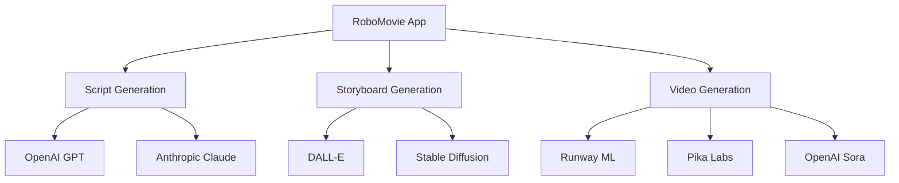

# RoboMovie AI Integration Guide

This guide details how RoboMovie integrates with various AI services to provide advanced video production capabilities.

## Overview



## AI Service Integration

### 1. Script Generation

The script generation system uses large language models to create professional screenplays.

#### OpenAI Integration

```typescript
interface OpenAIConfig {
  model: 'gpt-4' | 'gpt-3.5-turbo';
  temperature: number;
  maxTokens: number;
}

interface ScriptPrompt {
  title: string;
  genre: string;
  length: number;
  topic?: string;
  style?: string;
}

async function generateScript(
  prompt: ScriptPrompt,
  config: OpenAIConfig
): Promise<string> {
  // Implementation
}
```

#### Prompt Engineering

Example of a structured prompt for script generation:

```typescript
function buildScriptPrompt(params: ScriptPrompt): string {
  return `Create a professional screenplay with the following specifications:
  
Title: "${params.title}"
Genre: ${params.genre}
Length: ${params.length} minutes
${params.topic ? `Topic: ${params.topic}` : ''}
${params.style ? `Style: ${params.style}` : ''}

Requirements:
1. Follow standard screenplay format
2. Include scene descriptions
3. Write natural dialogue
4. Maintain consistent pacing
5. Include camera directions
6. Consider practical filming constraints

Begin Screenplay:`;
}
```

### 2. Storyboard Generation

The storyboarding system uses image generation models to create visual representations of scenes.

#### DALL-E Integration

```typescript
interface DALLEConfig {
  model: 'dall-e-3';
  style: 'cinematic' | 'realistic' | 'artistic';
  size: '1024x1024' | '1792x1024' | '1024x1792';
}

interface StoryboardPrompt {
  scene: {
    description: string;
    location: string;
    timeOfDay: string;
    characters: string[];
    mood: string;
  };
  shot: {
    angle: string;
    composition: string;
    lighting: string;
  };
}

async function generateStoryboardImage(
  prompt: StoryboardPrompt,
  config: DALLEConfig
): Promise<string> {
  // Implementation
}
```

#### Prompt Enhancement

```typescript
function enhanceStoryboardPrompt(prompt: StoryboardPrompt): string {
  return `Create a ${prompt.shot.angle} shot of a scene where:

Location: ${prompt.scene.location}
Time: ${prompt.scene.timeOfDay}
Lighting: ${prompt.shot.lighting}
Mood: ${prompt.scene.mood}

Scene Description: ${prompt.scene.description}

Style Requirements:
- Cinematic composition
- Professional lighting
- High production value
- Clear focal point
- Depth and atmosphere

Technical Details:
- Camera Angle: ${prompt.shot.angle}
- Composition: ${prompt.shot.composition}
- Lighting Setup: ${prompt.shot.lighting}`;
}
```

### 3. Video Generation

Integration with various video generation AI models for creating and editing video content.

#### Runway ML Integration

```typescript
interface RunwayConfig {
  model: string;
  numFrames: number;
  fps: number;
  guidance: number;
}

interface VideoPrompt {
  description: string;
  style: string;
  motion: string;
  duration: number;
}

async function generateVideo(
  prompt: VideoPrompt,
  config: RunwayConfig
): Promise<string> {
  // Implementation
}
```

#### Pika Labs Integration

```typescript
interface PikaConfig {
  model: string;
  resolution: string;
  quality: 'draft' | 'standard' | 'high';
}

async function generateSceneVideo(
  storyboard: StoryboardPrompt,
  config: PikaConfig
): Promise<string> {
  // Implementation
}
```

## AI Service Management

### Service Selection

```typescript
interface AIServiceConfig {
  scriptGeneration: {
    provider: 'openai' | 'anthropic';
    config: OpenAIConfig | AnthropicConfig;
  };
  imageGeneration: {
    provider: 'dalle' | 'stability';
    config: DALLEConfig | StabilityConfig;
  };
  videoGeneration: {
    provider: 'runway' | 'pika' | 'sora';
    config: RunwayConfig | PikaConfig | SoraConfig;
  };
}
```

### Error Handling

```typescript
enum AIServiceError {
  RATE_LIMIT = 'RATE_LIMIT',
  INVALID_REQUEST = 'INVALID_REQUEST',
  SERVICE_UNAVAILABLE = 'SERVICE_UNAVAILABLE',
  CONTENT_FILTERED = 'CONTENT_FILTERED'
}

interface AIError {
  type: AIServiceError;
  message: string;
  retryAfter?: number;
  serviceProvider: string;
}

function handleAIError(error: AIError): void {
  switch (error.type) {
    case AIServiceError.RATE_LIMIT:
      // Implement retry logic
      break;
    case AIServiceError.CONTENT_FILTERED:
      // Adjust prompt and retry
      break;
    // Handle other cases
  }
}
```

## Content Safety

### Content Filtering

```typescript
interface ContentFilter {
  checkPrompt: (prompt: string) => boolean;
  filterResponse: (response: string) => string;
  validateImage: (image: Buffer) => Promise<boolean>;
}

const contentFilter: ContentFilter = {
  checkPrompt: (prompt) => {
    // Implement content checking logic
    return true;
  },
  filterResponse: (response) => {
    // Implement response filtering
    return response;
  },
  validateImage: async (image) => {
    // Implement image validation
    return true;
  }
};
```

## Cost Management

### Token Usage Tracking

```typescript
interface TokenUsage {
  scriptGeneration: number;
  imageGeneration: number;
  videoGeneration: number;
}

class TokenTracker {
  private usage: TokenUsage = {
    scriptGeneration: 0,
    imageGeneration: 0,
    videoGeneration: 0
  };

  trackScriptGeneration(tokens: number): void {
    this.usage.scriptGeneration += tokens;
  }

  // Additional tracking methods
}
```

### Cost Optimization

```typescript
interface CostOptimization {
  shouldUseGPT4: (prompt: string) => boolean;
  optimizeImageResolution: (scene: Scene) => DALLEConfig;
  calculateVideoQuality: (scene: Scene) => RunwayConfig;
}

const costOptimizer: CostOptimization = {
  shouldUseGPT4: (prompt) => {
    // Determine if GPT-4 is necessary based on complexity
    return prompt.length > 1000;
  },
  optimizeImageResolution: (scene) => {
    // Choose appropriate resolution based on scene requirements
    return {
      model: 'dall-e-3',
      size: '1024x1024',
      style: 'cinematic'
    };
  },
  calculateVideoQuality: (scene) => {
    // Determine optimal video generation settings
    return {
      model: 'standard',
      numFrames: 30,
      fps: 24,
      guidance: 7
    };
  }
};
```

## Best Practices

### 1. Prompt Engineering

- Use clear, specific language
- Include technical details
- Consider context and continuity
- Test and iterate prompts
- Document successful prompts

### 2. Error Handling

- Implement proper retry logic
- Handle rate limits gracefully
- Log and monitor errors
- Have fallback options
- Maintain service redundancy

### 3. Performance Optimization

- Cache common responses
- Batch similar requests
- Use appropriate model sizes
- Monitor and optimize costs
- Implement request queuing

### 4. Content Safety

- Filter inappropriate content
- Validate AI outputs
- Monitor user feedback
- Maintain content guidelines
- Implement user reporting

## Integration Examples

### 1. Script Generation

```typescript
async function generateMovieScript(settings: MovieSettings): Promise<Script> {
  const prompt = buildScriptPrompt({
    title: settings.title,
    genre: settings.genre,
    length: settings.length,
    topic: settings.topic
  });

  const config: OpenAIConfig = {
    model: costOptimizer.shouldUseGPT4(prompt) ? 'gpt-4' : 'gpt-3.5-turbo',
    temperature: 0.7,
    maxTokens: 4000
  };

  try {
    const script = await generateScript(prompt, config);
    return processScript(script);
  } catch (error) {
    handleAIError(error as AIError);
    throw error;
  }
}
```

### 2. Storyboard Generation

```typescript
async function generateSceneStoryboard(scene: Scene): Promise<Storyboard> {
  const prompt = buildStoryboardPrompt(scene);
  const config = costOptimizer.optimizeImageResolution(scene);

  try {
    const images = await Promise.all(
      scene.shots.map(shot => 
        generateStoryboardImage({
          scene: {
            description: scene.description,
            location: scene.location,
            timeOfDay: scene.timeOfDay,
            characters: scene.characters,
            mood: scene.mood
          },
          shot: {
            angle: shot.angle,
            composition: shot.composition,
            lighting: shot.lighting
          }
        }, config)
      )
    );

    return createStoryboard(scene, images);
  } catch (error) {
    handleAIError(error as AIError);
    throw error;
  }
}
```

## Monitoring and Analytics

### Usage Tracking

```typescript
interface AIUsageMetrics {
  trackRequest: (service: string, type: string) => void;
  trackError: (error: AIError) => void;
  getUsageReport: () => UsageReport;
}

const aiMetrics: AIUsageMetrics = {
  trackRequest: (service, type) => {
    // Implementation
  },
  trackError: (error) => {
    // Implementation
  },
  getUsageReport: () => {
    // Implementation
    return {
      requests: {},
      errors: {},
      costs: {}
    };
  }
};
```

## Additional Resources

- [OpenAI API Documentation](https://platform.openai.com/docs)
- [Runway ML Documentation](https://docs.runwayml.com)
- [Pika Labs Documentation](https://pika.art/docs)
- [Anthropic Claude Documentation](https://docs.anthropic.com)
