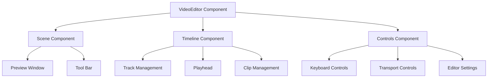

# RoboMovie Video Editor Documentation

This guide provides detailed information about the video editor component, its architecture, and how to work with it.

## Architecture Overview



## Core Components

### VideoEditor

The main container component that orchestrates all video editing functionality.

```typescript
interface VideoEditorProps {
  className?: string;
}

interface EditorState {
  size: {
    width: number;
    height: number;
  };
  scale: {
    index: number;
    unit: number;
    zoom: number;
    segments: number;
  };
  timeline: {
    duration: number;
    fps: number;
    width: number;
    height: number;
  };
  player: {
    isPlaying: boolean;
    volume: number;
    currentTime: number;
  };
}
```

### Scene Component

Handles the video preview and composition.

Key features:
- Real-time preview rendering
- Composition controls
- Effect previews
- Frame-accurate playback

### Timeline Component

Manages the video timeline and tracks.

Features:
- Multi-track support
- Drag and drop clips
- Zoom controls
- Frame-accurate scrubbing

## State Management

The video editor uses a dedicated Zustand store for state management:

```typescript
interface VideoEditorStore {
  // Scene Management
  selectedScene: Scene | null;
  sceneMediaStatus: Record<string, {
    video: { status: string; url: string };
    audio: { status: string; url: string };
  }>;

  // Playback Control
  player: {
    isPlaying: boolean;
    volume: number;
    speed: number;
  };
  currentFrame: number;
  
  // Timeline State
  timeline: {
    duration: number;
    zoom: number;
    tracks: Track[];
  };
  
  // Actions
  setScene: (scene: Scene) => void;
  updatePlayer: (updates: Partial<Player>) => void;
  setCurrentFrame: (frame: number) => void;
  addTrack: (track: Track) => void;
  removeTrack: (trackId: string) => void;
}
```

## Keyboard Controls

The editor supports extensive keyboard shortcuts:

```typescript
const KEYBOARD_SHORTCUTS = {
  PLAYBACK: {
    PLAY_PAUSE: 'Space',
    NEXT_FRAME: 'ArrowRight',
    PREV_FRAME: 'ArrowLeft',
    JUMP_FORWARD: 'Shift+ArrowRight',
    JUMP_BACKWARD: 'Shift+ArrowLeft',
    START: 'Home',
    END: 'End'
  },
  VOLUME: {
    UP: 'ArrowUp',
    DOWN: 'ArrowDown'
  },
  SPEED: {
    DECREASE: '[',
    INCREASE: ']'
  }
};
```

## Timeline Management

### Track System

```typescript
interface Track {
  id: string;
  type: 'video' | 'audio' | 'text';
  clips: Clip[];
  locked: boolean;
  visible: boolean;
}

interface Clip {
  id: string;
  type: 'video' | 'audio' | 'text';
  src: string;
  start: number;
  duration: number;
  track: number;
  effects?: Effect[];
}
```

### Clip Operations

The timeline supports various clip operations:

1. **Adding Clips**
```typescript
function addClip(track: Track, clip: Clip) {
  // Validate clip position
  // Check for overlaps
  // Add to track
}
```

2. **Moving Clips**
```typescript
function moveClip(clip: Clip, newStart: number, newTrack?: number) {
  // Validate new position
  // Handle track changes
  // Update timeline
}
```

3. **Trimming Clips**
```typescript
function trimClip(clip: Clip, newStart: number, newDuration: number) {
  // Validate trim points
  // Update clip boundaries
  // Refresh timeline
}
```

## Effects System

The editor supports various video and audio effects:

```typescript
interface Effect {
  id: string;
  type: EffectType;
  params: Record<string, any>;
  startTime: number;
  duration: number;
}

enum EffectType {
  // Video Effects
  FADE = 'fade',
  BLUR = 'blur',
  COLOR = 'color',
  TRANSFORM = 'transform',
  
  // Audio Effects
  FADE_AUDIO = 'fadeAudio',
  VOLUME = 'volume',
  EQ = 'eq'
}
```

## Export Configuration

```typescript
interface ExportConfig {
  format: 'mp4' | 'webm' | 'mov';
  quality: 'draft' | 'medium' | 'high';
  resolution: {
    width: number;
    height: number;
  };
  fps: number;
  bitrate: number;
}
```

## Integration with External Services

### Runway ML Integration

```typescript
interface RunwayConfig {
  apiKey: string;
  model: string;
  params: Record<string, any>;
}

async function generateVideoEffect(
  clip: Clip,
  effect: Effect,
  config: RunwayConfig
): Promise<string> {
  // Implementation
}
```

### Media Processing

```typescript
interface MediaProcessor {
  processVideo: (src: string, effects: Effect[]) => Promise<string>;
  processAudio: (src: string, effects: Effect[]) => Promise<string>;
  merge: (video: string, audio: string) => Promise<string>;
}
```

## Performance Optimization

### Rendering Strategy

1. **Preview Quality Levels**
```typescript
enum PreviewQuality {
  DRAFT = 'draft',      // Low resolution, fast
  MEDIUM = 'medium',    // Balanced
  HIGH = 'high'        // Full resolution
}
```

2. **Frame Caching**
```typescript
interface FrameCache {
  maxSize: number;
  frames: Map<number, ImageData>;
  add: (frame: number, data: ImageData) => void;
  get: (frame: number) => ImageData | undefined;
  clear: () => void;
}
```

### Memory Management

- Implement frame buffer limits
- Clear unused resources
- Monitor memory usage
- Implement garbage collection triggers

## Error Handling

```typescript
enum EditorErrorType {
  MEDIA_LOAD_FAILED = 'MEDIA_LOAD_FAILED',
  INVALID_OPERATION = 'INVALID_OPERATION',
  RENDER_ERROR = 'RENDER_ERROR',
  EXPORT_FAILED = 'EXPORT_FAILED'
}

interface EditorError {
  type: EditorErrorType;
  message: string;
  details?: any;
}
```

## Usage Examples

### Basic Setup

```typescript
import { VideoEditor } from '@/components/video-editor';

function MovieEditor() {
  return (
    <div className="editor-container">
      <VideoEditor className="w-full h-full" />
    </div>
  );
}
```

### Custom Configuration

```typescript
const editorConfig = {
  timeline: {
    duration: 300, // 10 seconds at 30fps
    fps: 30,
    width: 1920,
    height: 1080
  },
  defaultTracks: [
    { id: 'video-1', type: 'video' },
    { id: 'audio-1', type: 'audio' }
  ]
};

function CustomEditor() {
  return <VideoEditor config={editorConfig} />;
}
```

### Event Handling

```typescript
function EditorWithEvents() {
  const handleTimelineUpdate = (time: number) => {
    console.log('Current time:', time);
  };

  const handleTrackUpdate = (tracks: Track[]) => {
    console.log('Tracks updated:', tracks);
  };

  return (
    <VideoEditor
      onTimeUpdate={handleTimelineUpdate}
      onTracksChange={handleTrackUpdate}
    />
  );
}
```

## Troubleshooting

### Common Issues

1. **Performance Problems**
   - Reduce preview quality
   - Clear frame cache
   - Check clip count and effects

2. **Media Loading Issues**
   - Verify file formats
   - Check media permissions
   - Monitor network requests

3. **Timeline Sync Issues**
   - Check frame rate settings
   - Verify clip durations
   - Clear timeline cache

## Best Practices

1. **Resource Management**
   - Implement proper cleanup
   - Monitor memory usage
   - Cache frequently used assets

2. **Effect Usage**
   - Limit concurrent effects
   - Use appropriate preview quality
   - Implement effect presets

3. **Timeline Organization**
   - Use meaningful track names
   - Group related clips
   - Maintain consistent structure

## Contributing

When adding new features to the video editor:

1. Follow the existing architecture
2. Document all new components
3. Add appropriate tests
4. Consider performance implications
5. Update this documentation

## Additional Resources

- [Remotion Documentation](https://www.remotion.dev/docs)
- [FFmpeg Documentation](https://ffmpeg.org/documentation.html)
- [WebCodecs API](https://developer.mozilla.org/en-US/docs/Web/API/WebCodecs_API)
- [Media Source Extensions](https://developer.mozilla.org/en-US/docs/Web/API/Media_Source_Extensions_API)
